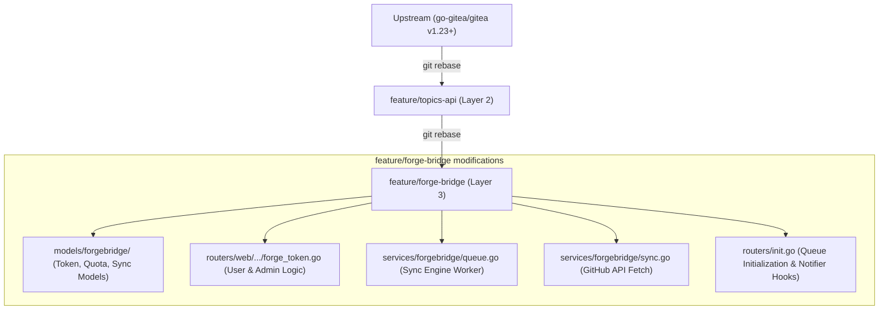

# 🔧 Gitea Forge Bridge — Layer 3 (API & UI Integration)

> Extended branch from `feature/topics-api`, managing cross-platform data (GitHub, Gitea) and token integration.

## ✨ Core Features

- **Personal Token Management:** UI for users to configure their own tokens (GitHub/Gitea) with standard formats.
- **Admin Token Orchestration:** Admin dashboard to manage token pools, allocate user quotas, and load balance GitHub API rate limits.
- **AES-256 Encryption:** Securely encrypt cross-platform tokens in the database.
- **Background Sync Engines (Queue):** Automated background worker utilizing Gitea's Queue manager to hook into `MigrateRepository` and sync profile information (Avatar, Bio, Location) directly from GitHub without blocking the main migration thread.
- **UI Auto-fill Integration:** Contextual data binding to automatically fill decrypted Forge tokens when a user visits the Migration settings page.

## 📂 Architecture



## 🚀 Installation & Deployment

```bash
# Must be executed on the deployment server or build environment
npx pnpm install
make frontend
TAGS="bindata" make backend
```

## 📖 Related Repositories

| Repo | Purpose |
|------|----------|
| [gitea-topics-custom](https://gitea.agentc.asia/hoangphuctran93/gitea-topics-custom) | Layer 1 — UI customizations |
| [gitea-custom-manager](https://gitea.agentc.asia/hoangphuctran93/gitea-custom-manager) | Control Hub |

---

# 🔧 Gitea Forge Bridge — Layer 3 (API & UI Integration)

> Nhánh mở rộng từ `feature/topics-api`, quản lý đa nền tảng (GitHub, Gitea) và liên thông dữ liệu.

## ✨ Các Chức Năng Chính

- **Quản Lý Token Cá Nhân:** Thêm UI cho User tự cấu hình Token (GitHub/Gitea) với định dạng chuẩn.
- **Quản Trị Token (Admin):** Màn hình Admin quản lý Token nhóm, phân bổ Quota cho từng người dùng, Load Balancing.
- **Mã hoá AES-256:** Bảo mật Token đa nền tảng trong DB.
- **Job Queue / Sync Engines:** Chạy ngầm (Background Worker) sử dụng Queue của Gitea để bắt sự kiện `MigrateRepository` và đồng bộ thông tin Profile (Avatar, Bio, Location) trực tiếp từ GitHub.
- **Cơ Chế Auto-fill (UC3):** Tự động giải mã và điền Token của người dùng vào giao diện Migrate khi chuyển dữ liệu từ GitHub.

## 📂 Sơ Đồ Kiến Trúc Tuỳ Chỉnh
Nhánh `feature/forge-bridge` kế thừa lại toàn bộ thay đổi của Layer 2, và phát triển tiếp Layer 3.


## ⚠️ Lệnh Triển Khai (Upgrade-Safe)

Khi nâng cấp hoặc đổi nhánh (ví dụ rebase lên v1.23+), **luôn phải cài đặt lại package và rebuild frontend** trước khi build backend nhằm tránh lỗi vỡ grid CSS 1-cột.

```bash
# Bắt buộc trên server chứa source code (hoặc môi trường build)
npx pnpm install
make frontend
TAGS="bindata" make backend
```

## 🔗 Repo Liên Quan

| Repo | Mục đích |
|------|----------|
| [gitea-topics-custom](https://gitea.agentc.asia/hoangphuctran93/gitea-topics-custom) | Layer 1 — UI customizations |
| [gitea-custom-manager](https://gitea.agentc.asia/hoangphuctran93/gitea-custom-manager) | Control Hub |
