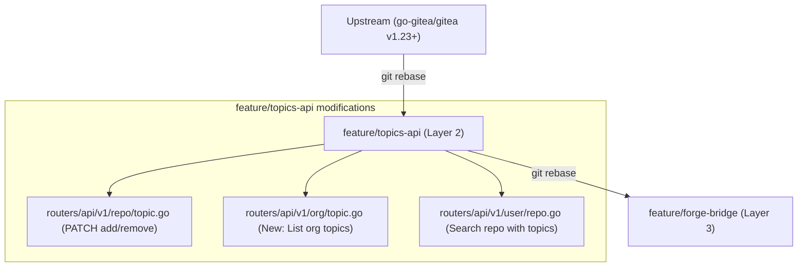

# 🔧 Gitea Topics Manager — Layer 2 (API Fork)

> Nhánh mở rộng từ [go-gitea/gitea](https://github.com/go-gitea/gitea) v1.22.0, bổ sung các API endpoints quản lý Topics nâng cao.

## ✨ Các Endpoint Mới

| Method | Endpoint | Mô tả |
|--------|----------|-------|
| `PATCH` | `/api/v1/repos/{owner}/{repo}/topics` | Add/remove topics an toàn (không ghi đè toàn bộ) |
| `GET` | `/api/v1/orgs/{org}/topics` | Liệt kê tất cả topics trong org |
| `GET` | `/api/v1/orgs/{org}/repos?topics=...` | Filter repos theo topics |

### PATCH Body Format

```json
{
  "add": ["cat-backend", "golang"],
  "remove": ["deprecated"]
}
```

### GET /orgs/{org}/topics Response

```json
{
  "topics": [
    {"name": "cat-backend", "count": 5},
    {"name": "dom-tourism", "count": 3}
  ],
  "total": 2
}
```

## 📂 Files Modified

| File | Thay đổi |
|------|----------|
| `modules/structs/repo.go` | Thêm `Topics []string` vào struct `Repository` |
| `modules/structs/repo_topic.go` | Thêm struct `PatchTopicOptions` |
| `services/convert/repository.go` | Populate `Topics` trong `innerToRepo()` |
| `routers/api/v1/repo/topic.go` | Handler `PatchTopics` |
| `routers/api/v1/org/topic.go` | Handler `ListOrgTopics` *(NEW)* |
| `routers/api/v1/user/repo.go` | Thêm filter `?topics=` cho `ListOrgRepos` |
| `routers/api/v1/api.go` | Đăng ký routes mới |

## ⚠️ Ghi Chú Cập Nhật & Sự Cố (Upgrade-Safe)

### Sự cố UI 1-cột (v1.23+)
- **Nguyên nhân:** Gitea v1.23 chuyển sang kiến trúc lưới CSS Grid (Tailwind) cho repo layout (`.repo-grid-filelist-sidebar`). CSS được tạo ra linh động nhờ Node (`pnpm`) và **không** được lưu trên Git.
- **Cách khắc phục Upgrade-Safe:** Khi nâng cấp hoặc đổi nhánh (ví dụ rebase lên v1.23+), **luôn phải cài đặt lại package và rebuild frontend** trước khi build backend:
  ```bash
  # Bắt buộc trên server chứa source code (hoặc môi trường build)
  npx pnpm install
  make frontend
  TAGS="bindata" make backend
  ```
  Nếu bỏ qua `make frontend`, CSS của v1.21 cũ sẽ được nhúng tĩnh (bindata) gây vỡ giao diện 1-cột.

### Sơ Đồ Kiến Trúc Tuỳ Chỉnh
Nhánh `feature/topics-api` bảo toàn nguyên vẹn lõi upstream, chỉ can thiệp vào các tệp API Router.



## 🔗 Repo Liên Quan

| Repo | Mục đích |
|------|----------|
| [gitea-topics-custom](https://gitea.agentc.asia/hoangphuctran93/gitea-topics-custom) | Layer 1 — UI customizations |
| [gitea-topics-fork](https://gitea.agentc.asia/hoangphuctran93/gitea-topics-fork) | Layer 2 — API Backend (repo này) |

## 📌 Releases

### v0.1.0-api — Phase 2: API Endpoints *(Current)*

**Ngày:** 2026-03-05 | **Base:** Gitea v1.22.0

**Nội dung:**
- ✅ Populate `Topics` vào repo list/detail API response
- ✅ `PATCH /repos/{owner}/{repo}/topics` — add/remove an toàn
- ✅ `GET /orgs/{org}/topics` — liệt kê topics của org
- ✅ `GET /orgs/{org}/repos?topics=...` — filter repos theo topics

**Testing:**
- 9 PASS / 0 FAIL / 2 SKIP (fork-only) trên `gitea.agentc.asia` v1.25.4

---

## 📄 License

MIT License (phần mở rộng) | Gitea Core: MIT License
